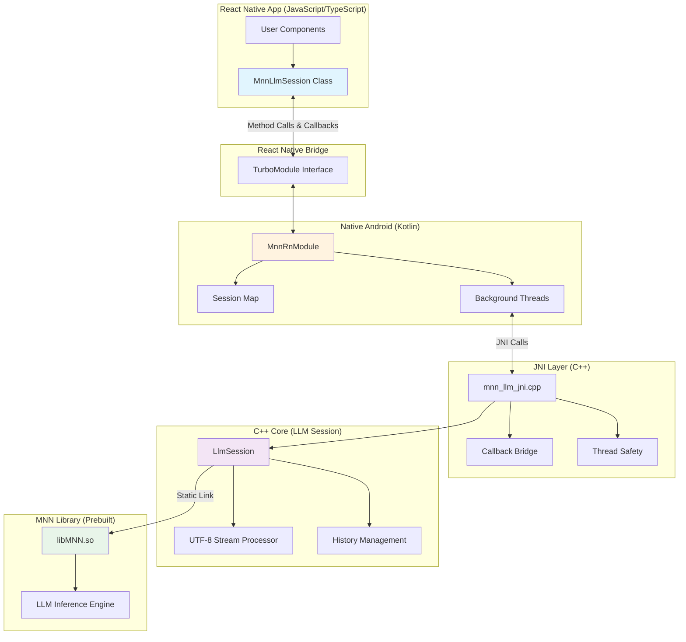
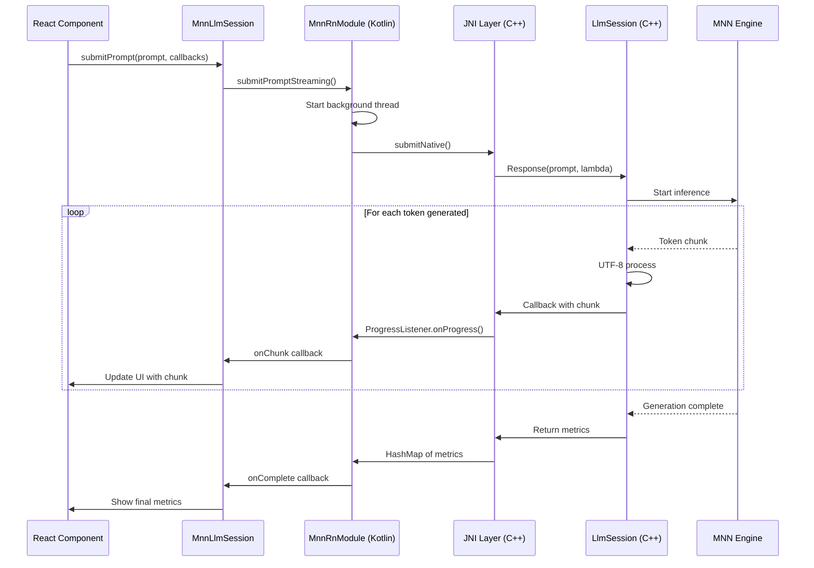

# MNN React Native Library - Final Architecture

## Executive Summary

This document presents the complete architecture for the MNN React Native library, focusing exclusively on **LLM text generation** with callback-based streaming API.

**Key Design Decisions:**
- ✅ **Single ABI**: arm64-v8a only (faster builds, modern Android devices)
- ✅ **API Pattern**: Callback-based + Async/Await for flexibility
- ✅ **Streaming**: Real-time token-by-token text generation
- ✅ **Scope**: LLM text generation ONLY (no audio, vision, or benchmarks)
- ✅ **Build**: Static linking of prebuilt libMNN.so via CMake

---

## System Architecture Diagram



---

## Data Flow: Text Generation with Streaming



---

## API Surface

### 1. Session Lifecycle

| Method | Type | Description |
|--------|------|-------------|
| [`init(config)`](IMPLEMENTATION_PLAN.md#llmsessionconfig) | Promise | Initialize session with model |
| [`release()`](IMPLEMENTATION_PLAN.md#release) | Promise | Free native resources |
| [`reset()`](IMPLEMENTATION_PLAN.md#reset) | Promise | Reset generation state |

### 2. Text Generation

| Method | Type | Description |
|--------|------|-------------|
| [`submitPrompt(...callbacks)`](IMPLEMENTATION_PLAN.md#submitprompt) | Callback | Stream with callbacks |
| [`submitPromptAsync(...)`](IMPLEMENTATION_PLAN.md#submitpromptasync) | Promise | Stream with async/await |
| [`submitWithHistory(...callbacks)`](IMPLEMENTATION_PLAN.md#submitwithhistory) | Callback | Multi-turn conversation |
| [`submitWithHistoryAsync(...)`](IMPLEMENTATION_PLAN.md#submitwithhistoryasync) | Promise | Multi-turn with await |

### 3. Configuration

| Method | Type | Description |
|--------|------|-------------|
| [`updateMaxNewTokens(n)`](IMPLEMENTATION_PLAN.md#updatemaxnewtokens) | Promise | Set max generation length |
| [`updateSystemPrompt(s)`](IMPLEMENTATION_PLAN.md#updatesystemprompt) | Promise | Set system prompt |
| [`updateAssistantPrompt(s)`](IMPLEMENTATION_PLAN.md#updateassistantprompt) | Promise | Set assistant template |
| [`updateConfig(json)`](IMPLEMENTATION_PLAN.md#updateconfig) | Promise | Update MNN config |

### 4. History & Info

| Method | Type | Description |
|--------|------|-------------|
| [`clearHistory()`](IMPLEMENTATION_PLAN.md#clearhistory) | Promise | Clear conversation |
| [`getSystemPrompt()`](IMPLEMENTATION_PLAN.md#getsystemprompt) | Promise | Get current system prompt |
| [`getDebugInfo()`](IMPLEMENTATION_PLAN.md#getdebuginfo) | Promise | Get debug information |

---

## File Structure

```
mnn-rn/
├── android/
│   ├── build.gradle                          [UPDATE] Add CMake config
│   ├── prebuilt/libs/
│   │   └── libMNN.so                         [EXISTS] Prebuilt ARM64
│   └── src/main/
│       ├── cpp/
│       │   ├── CMakeLists.txt                [CREATE] Build configuration
│       │   ├── mnn_llm_jni.cpp               [EXISTS] JNI bindings
│       │   ├── llm_session.cpp/h             [EXISTS] C++ session
│       │   ├── utf8_stream_processor.cpp/hpp [EXISTS] UTF-8 handling
│       │   ├── mls_log.cpp/h                 [EXISTS] Logging
│       │   └── include/                      [EXISTS] Headers
│       └── java/com/mnnrn/
│           ├── MnnRnModule.kt                [REWRITE] TurboModule impl
│           └── MnnRnPackage.kt               [EXISTS] Package
├── src/
│   ├── index.tsx                             [REWRITE] Main API
│   └── NativeMnnRn.ts                        [REWRITE] TurboModule spec
├── example/
│   └── src/
│       └── App.tsx                           [REWRITE] Demo app
├── IMPLEMENTATION_PLAN.md                    [NEW] Detailed plan
├── ARCHITECTURE_FINAL.md                     [NEW] This file
└── package.json                              [EXISTS]
```

---

## Implementation Checklist

### Phase 1: Build System (30 min)
- [ ] Create [`android/src/main/cpp/CMakeLists.txt`](IMPLEMENTATION_PLAN.md#task-1-build-system-configuration)
- [ ] Update [`android/build.gradle`](IMPLEMENTATION_PLAN.md#task-1-build-system-configuration)
- [ ] Test native library compilation
- [ ] Verify libMNN.so linking

### Phase 2: Native Module (1 hour)
- [ ] Rewrite [`android/src/main/java/com/mnnrn/MnnRnModule.kt`](IMPLEMENTATION_PLAN.md#task-2-kotlin-turbomodule-implementation)
- [ ] Implement session map management
- [ ] Add callback-based methods
- [ ] Add promise-based methods
- [ ] Test JNI method signatures match

### Phase 3: TypeScript API (45 min)
- [ ] Rewrite [`src/NativeMnnRn.ts`](IMPLEMENTATION_PLAN.md#task-3-typescript-implementation)
- [ ] Rewrite [`src/index.tsx`](IMPLEMENTATION_PLAN.md#task-3-typescript-implementation)
- [ ] Implement MnnLlmSession class
- [ ] Add type definitions
- [ ] Test compilation

### Phase 4: Example App (1 hour)
- [ ] Rewrite [`example/src/App.tsx`](IMPLEMENTATION_PLAN.md#task-4-example-app)
- [ ] Add model path configuration
- [ ] Add streaming display
- [ ] Add metrics display
- [ ] Add error handling

### Phase 5: Testing (1 hour)
- [ ] Build Android app
- [ ] Test initialization
- [ ] Test streaming generation
- [ ] Test conversation history
- [ ] Test configuration updates
- [ ] Check for memory leaks

---

## Key Implementation Details

### 1. Callback Threading

**Problem**: JNI callbacks must be invoked on the correct thread.

**Solution**:
```kotlin
Thread {
  try {
    val progressListener = ProgressListener { text ->
      onChunk.invoke(text)  // Safe: on background thread
      false
    }
    val metrics = submitNative(nativePtr, prompt, keepHistory, progressListener)
    onComplete.invoke(convertHashMapToWritableMap(metrics))
  } catch (e: Exception) {
    onComplete.invoke("Error: ${e.message}")
  }
}.start()
```

### 2. Session Management

**Problem**: Need to track multiple native session pointers.

**Solution**:
```kotlin
private val sessionMap = ConcurrentHashMap<Long, Long>()
private val sessionIdCounter = AtomicLong(1)

// On init
val sessionId = sessionIdCounter.getAndIncrement()
sessionMap[sessionId] = nativePtr

// On release
val nativePtr = sessionMap.remove(sessionId.toLong())
```

### 3. Static Linking

**Problem**: Link prebuilt libMNN.so into our shared library.

**Solution** (CMakeLists.txt):
```cmake
add_library(MNN SHARED IMPORTED)
set_target_properties(MNN PROPERTIES
  IMPORTED_LOCATION ${CMAKE_CURRENT_SOURCE_DIR}/../../../prebuilt/libs/libMNN.so
)

target_link_libraries(mnn-rn MNN android log)
```

### 4. UTF-8 Streaming

**Problem**: Tokens may not align with UTF-8 character boundaries.

**Solution**: Already implemented in [`utf8_stream_processor.cpp`](android/src/main/utf8_stream_processor.cpp)
- Buffers incomplete characters
- Emits complete UTF-8 sequences
- Handles multi-byte characters correctly

---

## API Usage Patterns

### Pattern 1: Simple Generation (Callback)

```typescript
const session = createMnnLlmSession();
await session.init({ modelDir: '/sdcard/models/llama' });

session.submitPrompt(
  'Hello!',
  true,
  (chunk) => console.log(chunk),
  (metrics) => console.log('Done:', metrics)
);
```

### Pattern 2: Async/Await with Streaming

```typescript
let response = '';
const metrics = await session.submitPromptAsync(
  'Explain React',
  true,
  (chunk) => { response += chunk; }
);
console.log('Complete:', response, metrics);
```

### Pattern 3: React Component

```typescript
function Chat() {
  const [text, setText] = useState('');
  
  const generate = (prompt: string) => {
    setText('');
    session.submitPrompt(
      prompt,
      true,
      (chunk) => setText(prev => prev + chunk),
      (metrics) => console.log(metrics)
    );
  };
  
  return <Text>{text}</Text>;
}
```

### Pattern 4: Conversation

```typescript
const messages = [
  { role: 'user', content: 'Hi' },
  { role: 'assistant', content: 'Hello!' },
  { role: 'user', content: 'Help me code' }
];

await session.submitWithHistoryAsync(
  messages,
  (chunk) => console.log(chunk)
);
```

---

## Performance Expectations

| Device | Model Size | Tokens/Second | Notes |
|--------|-----------|---------------|-------|
| Snapdragon 888+ | 3B (4-bit) | 20-30 | Good |
| Snapdragon 888+ | 7B (4-bit) | 10-15 | Acceptable |
| Snapdragon 8 Gen 2 | 3B (4-bit) | 30-40 | Excellent |
| Snapdragon 8 Gen 2 | 7B (4-bit) | 15-25 | Good |

**Optimization Tips:**
- Use quantized models (4-bit or 8-bit)
- Set reasonable maxNewTokens (512-1024)
- Batch UI updates instead of every chunk
- Release sessions when not needed

---

## Error Handling

### Common Errors

| Error | Cause | Solution |
|-------|-------|----------|
| "Session is not initialized" | Called method before init | Call init() first |
| "Invalid session ID" | Session was released | Create new session |
| "Model not found" | Wrong path | Check file exists |
| "Out of memory" | Model too large | Use smaller/quantized model |

### Best Practices

```typescript
// 1. Always try/catch async methods
try {
  await session.init(config);
} catch (error) {
  Alert.alert('Error', error.message);
}

// 2. Always release in cleanup
useEffect(() => {
  const s = createMnnLlmSession();
  s.init(config);
  return () => s.release();
}, []);

// 3. Handle callback errors
session.submitPrompt(
  prompt,
  true,
  onChunk,
  onComplete,
  (error) => Alert.alert('Error', error)
);
```

---

## Testing Strategy

### Unit Tests
- Session initialization
- Callback invocation
- Promise resolution
- Error handling

### Integration Tests
- End-to-end generation
- Multi-session handling
- Memory leak detection
- Thread safety

### Manual Tests
- Real device testing
- Different model sizes
- Long conversations
- Rapid fire requests

---

## Success Criteria

✅ All items must pass:

1. **Build**
   - [ ] CMake successfully compiles mnn-rn.so
   - [ ] libMNN.so statically linked
   - [ ] No build warnings

2. **Functionality**
   - [ ] Session init/release works
   - [ ] Streaming callbacks invoked correctly
   - [ ] Async/await methods work
   - [ ] Configuration updates applied

3. **Performance**
   - [ ] No memory leaks
   - [ ] Acceptable token throughput (>10 tok/s on mid-range device)
   - [ ] UI responsive during generation

4. **Developer Experience**
   - [ ] Type-safe TypeScript API
   - [ ] Clear error messages
   - [ ] Working example app
   - [ ] Complete documentation

---

## Next Actions

### For You (The User)
1. ✅ Review this architecture
2. ✅ Confirm approach is correct
3. ⏭️ Ask me to switch to Code mode
4. ⏭️ I'll implement all files

### For Me (Architect Mode)
1. ✅ Architecture designed
2. ✅ Plan documented
3. ⏭️ Ready to switch to Code mode
4. ⏭️ Begin implementation

---

## Questions?

Before switching to implementation, please confirm:

1. **Is the API design satisfactory?** (Callback + Async/Await pattern)
2. **Is the architecture clear?** (See diagrams above)
3. **Are you ready to proceed with implementation?**

Once confirmed, I'll switch to Code mode and begin implementing all the files according to this plan.

---

**Total Estimated Time**: ~4 hours  
**Primary Files to Create/Modify**: 5  
**Lines of Code**: ~1500  

**Ready to build?** 🚀